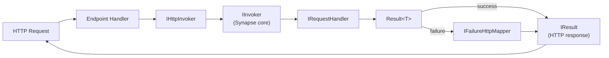

import Tabs from '@theme/Tabs';
import TabItem from '@theme/TabItem';

# ASP.NET Core Integration

`UnambitiousFx.Synapse.AspNetCore` provides two invoker wrappers that translate `Result<T>` to HTTP responses automatically, so endpoint handlers stay free of mapping boilerplate.

:::tip Recommended default for new HTTP surfaces
For a new route, prefer [Endpoints](./endpoints/) — an endpoint-per-class layer built on top of
`IHttpInvoker` that turns the common case into one attribute and one class declaration, with
generated binding and full Native AOT support. Reach for the hand-written `IHttpInvoker`/
`IMvcInvoker` patterns below when an endpoint's shape genuinely does not fit that model.
:::

## Install

<Tabs>
  <TabItem value="cli" label=".NET CLI" default>
    ```bash
    dotnet add package UnambitiousFx.Synapse.AspNetCore
    ```
  </TabItem>
  <TabItem value="packageref" label="PackageReference">
    ```xml
    <PackageReference Include="UnambitiousFx.Synapse.AspNetCore" Version="*" />
    ```
  </TabItem>
</Tabs>

## Setup

```csharp
builder.Services.AddSynapse(cfg => { /* ... */ });
builder.Services.AddSynapseAspNetCore();

var app = builder.Build();
app.UseSynapsePropagation(); // optional — reads traceparent, writes traceresponse + Trace-Id
```

## HTTP request flow



## `IHttpInvoker` — Minimal API

`IHttpInvoker` wraps `IInvoker` and converts `Result<T>` to `IResult` using `IFailureHttpMapper` for failures:

### Default success mapping — `200 OK`

```csharp
app.MapGet("/tasks/{id}", async (
    Guid id,
    [FromServices] IHttpInvoker invoker,
    CancellationToken ct) =>
    await invoker.InvokeAsync(new GetTaskQuery(id), ct));
// Success → 200 OK with the value serialized as JSON
// Failure → mapped by IFailureHttpMapper (default: ProblemDetails)
```

### Custom success mapping

Pass a delegate to control the success response:

```csharp
app.MapPost("/tasks", async (
    [FromBody] CreateTaskCommand cmd,
    [FromServices] IHttpInvoker invoker,
    CancellationToken ct) =>
    await invoker.InvokeAsync(
        cmd,
        id => Results.Created($"/tasks/{id}", id),  // ← custom success mapper
        ct));
```

### Fire-and-forget commands

```csharp
app.MapDelete("/tasks/{id}", async (
    Guid id,
    [FromServices] IHttpInvoker invoker,
    CancellationToken ct) =>
    await invoker.InvokeAsync(new DeleteTaskCommand(id), ct));
// Success → 200 OK (no body)
// Failure → ProblemDetails
```

### Streaming

```csharp
app.MapGet("/tasks/stream", (
    [FromServices] IHttpInvoker invoker,
    CancellationToken ct) =>
    invoker.InvokeStreamAsync(new StreamTasksQuery(), ct));
// Returns IAsyncEnumerable<TaskDto> — ASP.NET Core streams the JSON array
```

`IHttpInvoker.InvokeStreamAsync` unwraps `Result<TItem>` automatically: successful items are yielded, failures are silently skipped.

## `IMvcInvoker` — Controller-based API

Same contract as `IHttpInvoker` but returns `IActionResult` for use in MVC controllers:

```csharp
[ApiController]
[Route("tasks")]
public class TasksController : ControllerBase
{
    private readonly IMvcInvoker _invoker;

    public TasksController(IMvcInvoker invoker) => _invoker = invoker;

    [HttpGet("{id}")]
    public ValueTask<IActionResult> Get(Guid id, CancellationToken ct) =>
        _invoker.InvokeAsync(new GetTaskQuery(id), ct);

    [HttpPost]
    public ValueTask<IActionResult> Create([FromBody] CreateTaskCommand cmd, CancellationToken ct) =>
        _invoker.InvokeAsync(cmd, id => Created($"/tasks/{id}", id), ct);
}
```

## Failure mapping — `IFailureHttpMapper`

By default, failures are mapped to [RFC 9457 ProblemDetails](https://www.rfc-editor.org/rfc/rfc9457) responses. Replace the mapper with a custom implementation by registering it as a singleton **before** `AddSynapseAspNetCore`:

```csharp
builder.Services.AddSingleton<IFailureHttpMapper, MyFailureHttpMapper>();
builder.Services.AddSynapseAspNetCore();
```

`IFailureHttpMapper` (from `UnambitiousFx.Functional.AspNetCore.Mappers`) has a single method, `FailureHttpResponse? GetFailureResponse(IFailure failure)`. Return a `FailureHttpResponse` carrying the status code and body (or `null` to fall through). The invokers turn it into the appropriate `IResult` / `IActionResult`:

```csharp
using UnambitiousFx.Functional.AspNetCore.Mappers;

public class MyFailureHttpMapper : IFailureHttpMapper
{
    public FailureHttpResponse? GetFailureResponse(IFailure failure)
    {
        return failure switch
        {
            NotFoundFailure nf   => new FailureHttpResponse { StatusCode = 404, Body = new { nf.Message } },
            ValidationFailure vf => new FailureHttpResponse { StatusCode = 422, Body = new { vf.Message } },
            _                    => new FailureHttpResponse { StatusCode = 500, Body = new { failure.Message } },
        };
    }
}
```

:::tip
To override only a few failure types, subclass `DefaultFailureHttpMapper` (its `GetFailureResponse` is `virtual`) and call `base.GetFailureResponse(failure)` for the cases you don't handle.
:::

## Propagation middleware

`UseSynapsePropagation()` recovers the flow identity of an incoming request from W3C trace context, and writes the resulting trace id back onto the response so callers can correlate across service boundaries:

```csharp
app.UseSynapsePropagation();
```

Add it early, before any endpoint runs.

Identity comes from the inbound `traceparent` header: its trace id becomes `IContext.TraceId` and its span id becomes `IContext.CausationId`. The `baggage` header is recovered alongside it for business values (falling back to the pre-W3C `Correlation-Context` name when `baggage` is absent, so traffic from older ASP.NET Core services keeps its values). Synapse reads **no identity header of its own** — a request without `traceparent` simply starts a new flow with a trace id minted by `IContextFactory`.

### Headers

| Direction | Header | Carries |
| --- | --- | --- |
| in | `traceparent` | trace id → `TraceId`, span id → `CausationId` |
| in | `tracestate` | vendor trace data, passed through |
| in | `baggage`, or `Correlation-Context` | business values |
| out | `traceresponse` | `00-<trace-id>-<span-id>-<flags>` — W3C Trace Context Level 2 |
| out | `Trace-Id` | the bare 32-hex trace id |

Two response headers, because they serve different readers. `traceresponse` is the standards-track one, so conformant tooling can continue the trace from a response. `Trace-Id` is for people: a bare trace id that pastes straight into a tracing backend, which is what an operator or a support ticket needs. W3C defines no header for that, because it is an operational convenience rather than a protocol need.

Note the absent `X-` prefix — **RFC 6648 deprecated that convention in 2012**. Set `TraceIdHeaderName` to `X-Correlation-Id` if existing clients depend on the old name.

Both are written only when a context was actually created during the request, so routes that never touch the mediator — static files, health checks — do not get a trace id invented for them. `traceresponse` additionally requires a current W3C activity: it reports the response's span, and with no span there is nothing to report.

### Options

```csharp
app.UseSynapsePropagation(options =>
{
    options.TraceIdHeaderName      = "X-Request-Trace";  // default: Trace-Id (response only)
    options.EmitTraceResponse      = false;              // default: true
    options.TrustIncomingHeader    = false;              // default: true
    options.ClientTraceIdBaggageKey = "client.trace_id";
});
```

`HeaderName` names the **response** header only. The inbound header is `traceparent`, whose name is fixed by the W3C specification.

### Trusted and untrusted callers

`TrustIncomingHeader` defaults to `true`, which is right for **service-to-service traffic behind a gateway**: continuing the caller's trace is what makes a flow traceable across services, and is the reason this middleware exists.

Set it to `false` on an **internet-facing** application. A `traceparent` is chosen by the caller and is exactly as forgeable as any other client input, so a hostile client can pick a trace id that collides with another flow's and make your log correlation misleading. With trust off:

- the trace id is minted server-side;
- the inbound trace context is discarded, so the caller cannot decide this flow's identity;
- inbound baggage is discarded too — it is caller-controlled text that would otherwise land in your log scope and be forwarded onwards;
- the caller's trace id is preserved as baggage under `ClientTraceIdBaggageKey`, so it stays queryable without being trusted.

Discarding the header is not enough on its own, which is worth knowing if you write your own boundary adapter. ASP.NET Core parses `traceparent` and parents the request `Activity` to it **before any middleware runs**, and `IContext` otherwise takes its identity from `Activity.Current` when nothing was propagated — so clearing the inbound trace context alone would let the caller supply identity through the ambient activity instead. The middleware also sets `PropagatedContext.SuppressAmbientTrace`, which disqualifies the ambient activity as a source of identity; a non-HTTP adapter that refuses inbound trace context must set it too.

One consequence: in this mode `IContext.TraceId` deliberately differs from `Activity.Current.TraceId`, because Synapse cannot un-parent an activity the host created before the pipeline started. Your spans still carry the caller's trace id unless you configure your tracing exporter to distrust the header as well.

Everything Synapse controls carries the **server-minted** id: `IContext.TraceId`, the `Trace-Id` and `traceresponse` response headers, the log scope, and what leaves the process — the `traceparent` written onto outbound `HttpClient` calls and captured into outbox entries. Propagating the ambient activity's id there instead would forward onward exactly the value this mode exists to refuse, and re-parent later outbox work into a trace a client picked.

:::warning
The trace id is a label for correlating logs and spans. It is never an authorization input, in either mode. Requiring W3C format changes nothing here — a client-supplied trace id is as forgeable as any other client-supplied value.
:::

### Browser callers

For a browser to send trace context and read the trace id back, your CORS policy needs both sides — this is the usual reason a SPA cannot read the id back:

```csharp
policy.WithHeaders("traceparent", "tracestate", "baggage")  // Access-Control-Allow-Headers
      .WithExposedHeaders("traceresponse", "Trace-Id"); // Access-Control-Expose-Headers
```

The frontend generates `traceparent` with an OpenTelemetry JS propagator (or by hand). See [Propagation](./propagation.mdx) for outbound calls, message transports and the outbox.

:::caution NativeAOT / Trim compatibility
When publishing with `PublishAot=true` or full trimming, use `WebApplication.CreateSlimBuilder` and configure a JSON serializer context. Also use the [Source Generator](./source-generator) — the generated `RegisterGroup` implements `IEventDispatcherRegistration` and wires AOT-safe dispatch delegates automatically.
:::

## NativeAOT / Trim compatibility

When publishing with `PublishSingleFile=true` or `PublishAot=true`, use `WebApplication.CreateSlimBuilder` and configure the JSON serializer context so all request/response types are included:

```csharp
var builder = WebApplication.CreateSlimBuilder(args);

builder.Services.ConfigureHttpJsonOptions(opts =>
    opts.SerializerOptions.TypeInfoResolverChain.Insert(0, AppJsonContext.Default));

[JsonSerializable(typeof(CreateTaskCommand))]
[JsonSerializable(typeof(Guid))]
[JsonSerializable(typeof(TaskDto))]
internal partial class AppJsonContext : JsonSerializerContext { }
```

Also use the [Source Generator](./source-generator) — the generated `RegisterGroup` implements both `IRegisterGroup` and `IEventDispatcherRegistration`, so a single `AddRegisterGroup(new RegisterGroup())` call covers NativeAOT-safe polymorphic event dispatch.

## See also

- [Endpoints](./endpoints/) — the recommended default for a new HTTP surface: endpoint-per-class, generated binding, full Native AOT support.
- [Getting Started](./getting-started) — full end-to-end example with Minimal API.
- [Streaming](./streaming) — `IHttpInvoker.InvokeStreamAsync` details.
- [Source Generator](./source-generator) — NativeAOT-safe handler registration.
- [Context](./context) — `IContext.TraceId` and HTTP propagation.
