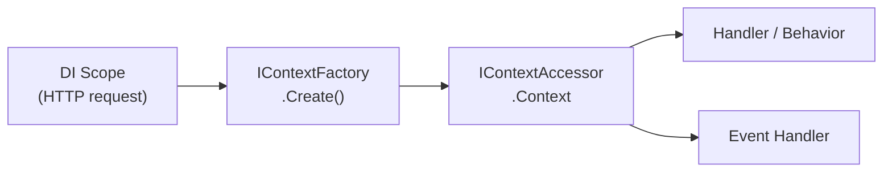

# Context

`IContext` is a per-DI-scope object that flows through every step of a request's lifecycle — the handler, all pipeline behaviors, and any events published during that request. It carries three separate surfaces, and which one you reach for is decided by a single question: **does this value need to leave the process?**

| Surface      | Type                       | Crosses process boundaries | Use for                                          |
| ------------ | -------------------------- | -------------------------- | ------------------------------------------------ |
| **Identity** | typed properties           | yes, always                | the flow ids and timestamp                       |
| **Baggage**  | `string` → `string`, capped | yes, always                | small business values (`tenant.id`, `user.id`)   |
| **Features** | `IContextFeature`          | never                      | process-local typed state                        |

The split is deliberate. A single untyped `string → object` bag cannot answer that question — anything in it might or might not be serializable, might or might not be safe to send to another service — so the three surfaces make the answer a property of *where you put the value* rather than a convention you have to remember.

## Lifecycle

One `IContext` instance is created per DI scope. In an ASP.NET Core application, one HTTP request equals one DI scope, so each request gets its own context:



The context is created lazily on first access via `IContextFactory`, then cached on `IContextAccessor` for the lifetime of the scope.

## Flow identity

Identity **is** W3C trace context — not a parallel scheme that sits beside it. `TraceId` is the 32-character hex trace id, byte for byte what your tracing backend displays, so one search string works in both your application logs and Jaeger, Tempo or Application Insights.

| Property     | Type              | Lifetime                            | Purpose                                                                     |
| ------------ | ----------------- | ----------------------------------- | --------------------------------------------------------------------------- |
| `TraceId`    | `string`          | constant for the whole business flow | groups every request, message and retry stemming from one originating action |
| `CausationId` | `string?`         | the immediate predecessor's span id  | builds the causality **tree**; `null` at the root of a flow                  |
| `OccurredAt` | `DateTimeOffset`  | fixed at creation                    | when this unit of work entered the system                                    |

```csharp
public class MyHandler : IRequestHandler<MyCommand, string>
{
    private readonly IContext _context;

    public MyHandler(IContext context) => _context = context;

    public ValueTask<Result<string>> HandleAsync(MyCommand cmd, CancellationToken ct = default)
    {
        var traceId = _context.TraceId;      // the whole flow — paste this into Jaeger
        var causedBy = _context.CausationId; // the span that caused this unit of work
        return ValueTask.FromResult(Result.Success(traceId));
    }
}
```

### Where `TraceId` comes from

Three sources, in order:

1. the inbound `traceparent` header, parsed at the boundary;
2. `Activity.Current.TraceId`, when an activity exists;
3. a freshly minted trace id.

Step 3 is why `AddSynapse` works with **no** OpenTelemetry configured. With no registered `ActivityListener`, `ActivitySource.StartActivity` returns `null` and `Activity.Current` stays null, so a purely computed property would leave you with no id at all — no correlation in the log scope and an empty outbox partition key. `TraceId` is therefore never null or empty.

:::note It equals the ambient activity
Whenever an activity exists, `context.TraceId == Activity.Current.TraceId.ToHexString()` — because that is
where the value came from. It is captured once at context creation rather than read on each access, so it
also stays stable if an unrelated root activity starts mid-request, and it avoids re-allocating the hex
string on every read.
:::

:::note When is `CausationId` set?
It is the **sender's span id**, taken from the inbound `traceparent`. Two consequences:

- It is `null` when nothing upstream was recording. Causation is a diagnostic nicety; `TraceId` is
  always present.
- One context exists per DI scope, and that context *is* the unit of work. An event published with
  `EmitMode.Now` is dispatched inside the same scope, so nothing was crossed and `CausationId` does not
  change. It becomes meaningful when a **boundary** is crossed and a new context is built — an event
  dispatched from the outbox, a message consumed from a broker, or an inbound HTTP call.
:::

Identity is recovered at an inbound boundary and stamped onto outbound calls automatically — see [Propagation](./propagation.mdx).

## Baggage

Baggage is the only free-form state that crosses process boundaries. It is propagated as the W3C `baggage` header, so it is string-keyed, string-valued and size-limited.

```csharp
// Returns false if the entry was rejected — see the limits below
context.SetBaggage("tenant.id", "acme");

if (context.TryGetBaggage("tenant.id", out var tenantId))
    Console.WriteLine(tenantId);

var tenantId = context.GetBaggage("tenant.id"); // null if missing
```

`SetBaggage` returns `bool` rather than throwing. W3C caps baggage at **64 entries and 8192 bytes** (`BaggageLimits`), and an entry that would exceed either cap, or whose key or value cannot be serialized into a header, is refused. Rejection is reported rather than raised so that oversized *inbound* baggage from a peer degrades instead of failing the request. If you care whether an entry made it, check the return value and log it.

The byte budget counts the **percent-encoded** form, because that is what the header carries: a value full of commas or accented characters costs up to three bytes per byte. Keys must be header tokens — no commas, equals signs, whitespace or control characters — while values may contain anything but control characters, since they are escaped on the way out.

:::warning
Baggage travels to **every** downstream service, including third parties outside your control, and it persists across hops Synapse does not manage. Never put confidential values in it — no tokens, no personal data, no internal identifiers you would not put in a URL.
:::

For state that must stay in this process, use a [feature](#feature-bag) instead. Features are never serialized.

## Context factories

Two built-in factories are available. Configure them in `AddSynapse`:

| Factory                 | What it creates                                                        |
| ----------------------- | ---------------------------------------------------------------------- |
| `DefaultContextFactory` | Flow identity from trace context, plus any inbound baggage.            |
| `SlimContextFactory`    | The same identity, but inbound baggage is **discarded**.                 |

Both take the inbound state as a parameter — `IContextFactory.Create(PropagatedContext inbound)` — so identity is decided **when the context is created**, never patched onto it afterwards. See [Propagation](./propagation.mdx#why-extraction-happens-at-creation) for why that matters.

`SlimContextFactory` differs only in dropping baggage: there is no cheaper trace id to generate, so identity is identical. Choose it when the application does not propagate business values and does not want to pay for parsing and holding them. It has to be selected explicitly, so dropping baggage is a stated decision rather than a surprise.

:::note
The context does not snapshot trace or span ids. Distributed tracing state lives on
`Activity.Current`, which is ambient (`AsyncLocal`) and always reflects the *current* span — a
snapshot taken at context creation would go stale as pipeline stages start child activities. Read
`Activity.Current` directly, or use the `Unambitious.Synapse` `ActivitySource` (see
[Observability](./observability.mdx)). Trace context still travels across boundaries; it is just not
stored on the context. See [Propagation](./propagation.mdx#one-identity-w3c-trace-context).
:::

```csharp
services.AddSynapse(cfg =>
{
    cfg.UseDefaultContextFactory(); // default — no need to call if this is what you want
    // or
    cfg.UseSlimContextFactory();
    // or
    cfg.UseContextFactory<MyCustomFactory>();
});
```

## Feature bag

`IContextFeature` provides a typed extension point for attaching domain-specific data to the context without modifying `IContext` itself.

### Define a feature

```csharp
public class UserFeature : IContextFeature
{
    public string Name => "User";
    public string UserId { get; init; } = "";
    public string[] Roles { get; init; } = [];
}
```

### Set the feature

Set it in a pipeline behavior before the handler runs, using `SetFeature` (the feature bag — distinct from the metadata bag). Make the behavior open-generic and mark it `[PipelineBehavior]` so the source generator applies it to every matching handler:

```csharp
[PipelineBehavior]
public sealed class AuthenticationBehavior<TRequest, TResponse>
    : IRequestPipelineBehavior<TRequest, TResponse>
    where TRequest : IRequest<TResponse>
    where TResponse : notnull
{
    private readonly IContextAccessor _contextAccessor;
    private readonly ICurrentUser _currentUser;

    public AuthenticationBehavior(IContextAccessor contextAccessor, ICurrentUser currentUser)
    {
        _contextAccessor = contextAccessor;
        _currentUser = currentUser;
    }

    public ValueTask<Result<TResponse>> HandleAsync(
        TRequest request,
        RequestHandlerDelegate<TRequest, TResponse> next,
        CancellationToken cancellationToken = default)
    {
        _contextAccessor.Context.SetFeature(new UserFeature
        {
            UserId = _currentUser.Id,
            Roles  = _currentUser.Roles
        });

        return next(request, cancellationToken);
    }
}
```

See [Pipeline Behaviors](./pipelines) for the full behavior model, registration, and ordering.

### Read the feature

```csharp
// Try to get feature (returns false if not set)
if (context.TryGetFeature<UserFeature>(out var user))
    Console.WriteLine(user.UserId);

// Get or null
var user = context.GetFeature<UserFeature>();

// Get or throw MissingContextFeatureException
var user = context.MustGetFeature<UserFeature>();
```

## Publishing events from handlers

The context carries flow state; it does not publish. Inject `IEmitter` to publish and `IOutboxCommit` to commit:

```csharp
public class CreateTaskHandler(IEmitter emitter, IOutboxCommit outboxCommit) { ... }

await emitter.EmitAsync(new TaskCreatedEvent(id, cmd.Title), ct);

// With explicit emit mode
await emitter.EmitAsync(new TaskCreatedEvent(id, cmd.Title), EmitMode.Outbox, ct);

// Dispatch what the outbox is holding
await outboxCommit.CommitAsync(ct);
```

`IContext` used to expose `PublishEventAsync` and `CommitEventsAsync` as sugar over these two. They were removed in v2: the sugar made the context depend on the publish stack, which in turn forced the outbox to reach the current flow through ambient `AsyncLocal` state instead of taking the accessor as a dependency. See [Migrating to v2](./migration-v2.mdx#5-icontext-no-longer-publishes-events).

## Injecting the context

`IContext` and `IContextAccessor` are both registered in DI, and both resolve to the same object for the scope:

```csharp
// The usual case — inject IContext directly
public class MyHandler(IContext context) : IRequestHandler<MyQuery, string>  { ... }

// Inject IContextAccessor when you need to know whether a context exists yet
public class MyMiddleware(IContextAccessor contextAccessor) { ... }
```

`IContextAccessor` adds one thing over `IContext`: `IsInitialized`. Reading `Context` is what *creates* the context, so a component that only wants to observe a context that already exists — a response-header writer, an outbound HTTP handler — must ask `IsInitialized` first. Reading `Context` to find out would always answer "yes".

The context cannot be replaced once created. Inbound identity is supplied to the factory instead, via `IInboundContextStore` — see [Propagation](./propagation.mdx#why-extraction-happens-at-creation).

## See also

- [Propagation](./propagation.mdx) — carrying flow identity across HTTP calls, messages and the outbox.
- [ASP.NET Core Integration](./aspnetcore) — `UseSynapsePropagation()` middleware.
- [Pipeline Behaviors](./pipelines) — set context features in behaviors before the handler runs.
- [Events](./events) — `IEmitter.EmitAsync` and `EmitMode`.
