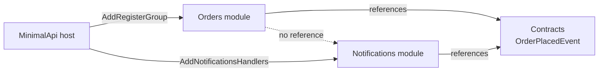

# Examples

Runnable projects in the [`examples/`](https://github.com/UnambitiousFx/Synapse/tree/main/examples) directory demonstrate Synapse features in context. Each project builds and runs stand-alone from the repo root.

## Overview

| Project | Type | What it demonstrates |
|---------|------|----------------------|
| [`GettingStarted`](https://github.com/UnambitiousFx/Synapse/tree/main/examples/GettingStarted) | Console (step-by-step tutorial) | Commands, queries, events, streaming, pipelines, context, error handling, validation — organized as Steps 1–7 |
| [`MinimalApi`](https://github.com/UnambitiousFx/Synapse/tree/main/examples/MinimalApi) | ASP.NET Core + Native AOT | Canonical integration tour: all core features + pipeline ordering + CQRS enforcement + cross-assembly composition |
| [`MinimalApi.Modules.Contracts`](https://github.com/UnambitiousFx/Synapse/tree/main/examples/MinimalApi.Modules.Contracts) | Class library (shared contract) | Shared `IEvent` contract — the decoupling seam between Orders and Notifications |
| [`MinimalApi.Modules.Orders`](https://github.com/UnambitiousFx/Synapse/tree/main/examples/MinimalApi.Modules.Orders) | Class library (module) | Emitter module using `[RequestHandler<>]` + source-generated `RegisterGroup`; publishes `OrderPlacedEvent` |
| [`MinimalApi.Modules.Notifications`](https://github.com/UnambitiousFx/Synapse/tree/main/examples/MinimalApi.Modules.Notifications) | Class library (module) | Subscriber module using **manual** `cfg.RegisterEventHandler<>()` — no source generator |
| [`EndpointsApi`](https://github.com/UnambitiousFx/Synapse/tree/main/examples/EndpointsApi) | ASP.NET Core + Native AOT | Every [Endpoints](./endpoints/) shape: all four high-level base classes, groups, streaming, a computed route, and both low-level tiers (`RawEndpoint`, `RawEndpoint<TRequest, TResponse>`) |

---

## Running an example

```bash
# Console tutorial
cd examples/GettingStarted && dotnet run

# ASP.NET Core (full feature tour)
cd examples/MinimalApi && dotnet run
```

All examples reference Synapse via local project references, so they always build against the current source.

---

## Modular monolith: decoupled cross-assembly events

The `MinimalApi.Modules.*` projects demonstrate a **modular-monolith** pattern where two feature modules communicate through domain events without knowing about each other.

### Topology



Neither `Orders` nor `Notifications` references the other. Both depend only on `Contracts` which holds `OrderPlacedEvent : IEvent`.

### Registration: source-gen vs. manual — side by side

The two modules use different registration styles to highlight that both are first-class options.

**Orders (source generator)**

```csharp
// In MinimalApi.Modules.Orders — handler carries the attribute
[RequestHandler<PlaceOrderCommand, Guid>]
public sealed class PlaceOrderCommandHandler : IRequestHandler<PlaceOrderCommand, Guid>
{
    public async ValueTask<Result<Guid>> HandleAsync(PlaceOrderCommand request, CancellationToken ct)
    {
        var orderId = _store.Place(request.Product);
        await _emitter.EmitAsync(new OrderPlacedEvent { OrderId = orderId, ... }, ct);
        return Result.Success(orderId);
    }
}

// In Program.cs (host) — one call wires everything the generator discovered
cfg.AddRegisterGroup(new global::UnambitiousFx.Examples.MinimalApi.Modules.Orders.RegisterGroup());
```

**Notifications (manual registration)**

```csharp
// In MinimalApi.Modules.Notifications — NO [EventHandler<T>] attribute
public sealed class OrderPlacedNotificationHandler : IEventHandler<OrderPlacedEvent>
{
    public ValueTask<Result> HandleAsync(OrderPlacedEvent @event, CancellationToken ct)
    {
        _log.Add(new NotificationEntry { OrderId = @event.OrderId, ... });
        return ValueTask.FromResult(Result.Success());
    }
}

// In NotificationsModule.cs — explicit extension method the host calls
public static ISynapseConfig AddNotificationsHandlers(this ISynapseConfig cfg)
{
    // Registers the DI service AND the AOT-safe dispatch delegate in one call.
    cfg.RegisterEventHandler<OrderPlacedNotificationHandler, OrderPlacedEvent>();
    return cfg;
}

// In Program.cs (host)
cfg.AddNotificationsHandlers();
```

### Event flow

```
POST /orders  { "product": "Widget", "quantity": 2 }
  └─ PlaceOrderCommandHandler  [Orders module]
       └─ IEmitter.EmitAsync(new OrderPlacedEvent { ... })
             └─ OrderPlacedNotificationHandler  [Notifications module]
                  └─ NotificationLog.Add(entry)

GET /notifications
  └─ Returns [ { orderId, product, quantity, receivedAt }, ... ]
```

### Key files

| File | Role |
|------|------|
| [`MinimalApi.Modules.Contracts/OrderPlacedEvent.cs`](https://github.com/UnambitiousFx/Synapse/blob/main/examples/MinimalApi.Modules.Contracts/OrderPlacedEvent.cs) | Shared `IEvent` record |
| [`MinimalApi.Modules.Orders/Handlers/PlaceOrderCommandHandler.cs`](https://github.com/UnambitiousFx/Synapse/blob/main/examples/MinimalApi.Modules.Orders/Handlers/PlaceOrderCommandHandler.cs) | Source-gen handler, emits event |
| [`MinimalApi.Modules.Orders/OrdersModule.cs`](https://github.com/UnambitiousFx/Synapse/blob/main/examples/MinimalApi.Modules.Orders/OrdersModule.cs) | `AddOrdersModule()` + `MapOrdersEndpoints()` |
| [`MinimalApi.Modules.Notifications/Handlers/OrderPlacedNotificationHandler.cs`](https://github.com/UnambitiousFx/Synapse/blob/main/examples/MinimalApi.Modules.Notifications/Handlers/OrderPlacedNotificationHandler.cs) | Manual handler, no attribute |
| [`MinimalApi.Modules.Notifications/NotificationsModule.cs`](https://github.com/UnambitiousFx/Synapse/blob/main/examples/MinimalApi.Modules.Notifications/NotificationsModule.cs) | `AddNotificationsHandlers(ISynapseConfig)` + endpoint |
| [`MinimalApi/Http/modules.http`](https://github.com/UnambitiousFx/Synapse/blob/main/examples/MinimalApi/Http/modules.http) | HTTP test file — place order, then verify notification |

:::tip
Open `examples/MinimalApi/Http/modules.http` in your IDE's HTTP client, run the requests top-to-bottom,
and observe the cross-module log lines in the terminal to confirm the event was delivered.
:::
