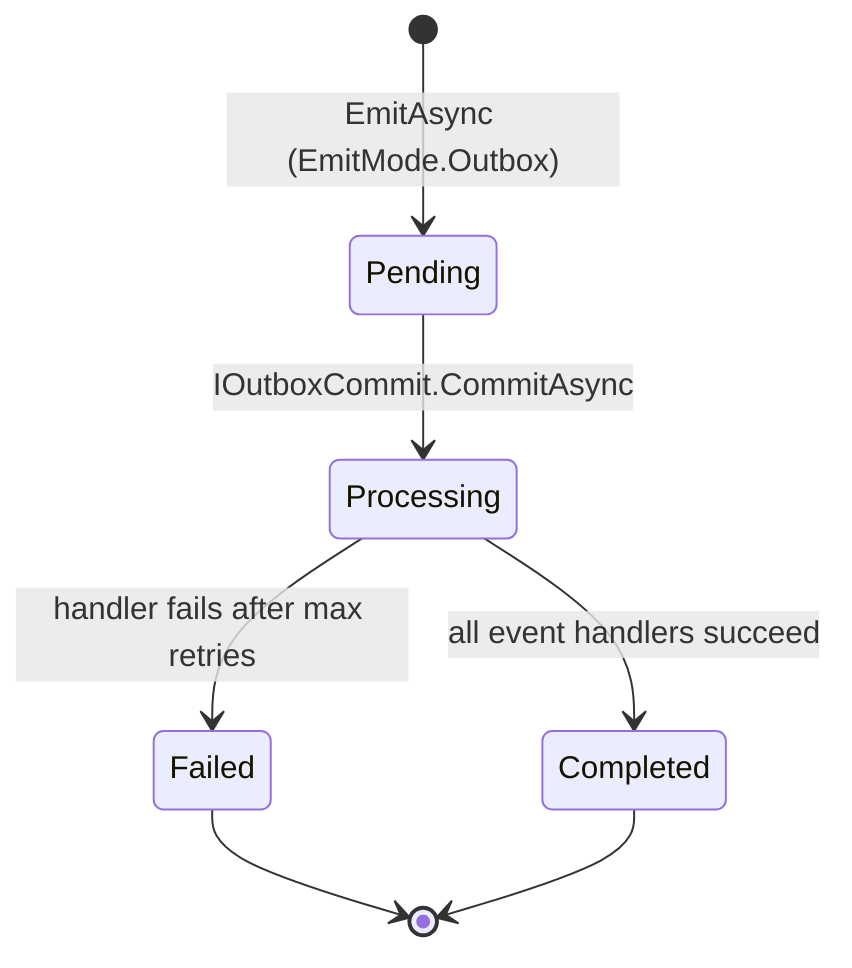

# Outbox Pattern

The outbox pattern decouples event publishing from handler execution. Instead of dispatching events immediately when `EmitAsync` is called, events are stored in an **outbox** and dispatched later in a controlled batch. This is useful when you need to guarantee that events are only dispatched after a database transaction commits successfully.

## How it works



1. `EmitAsync(event, EmitMode.Outbox)` stores the event in `IEventOutboxStorage`. No dispatch occurs.
2. Calling `IOutboxCommit.CommitAsync()` moves pending events through the event pipeline and handlers.
3. If a handler fails, the outbox retries with exponential backoff up to `MaxRetryAttempts`.
4. After all retry attempts are exhausted, the event is marked `Failed` (dead-lettered).

## Using the outbox

### Store and defer an event

```csharp
// Store event in outbox — nothing dispatched yet
await emitter.EmitAsync(new TaskCreatedEvent(id, title), EmitMode.Outbox, ct);
```

### Flush after your side-effects commit

```csharp
public class CreateTaskHandler : IRequestHandler<CreateTaskCommand, Guid>
{
    private readonly ITaskRepository _repository;
    private readonly IEmitter _emitter;
    private readonly IOutboxCommit _outboxCommit;

    public CreateTaskHandler(ITaskRepository repository, IEmitter emitter, IOutboxCommit outboxCommit)
    {
        _repository = repository;
        _emitter = emitter;
        _outboxCommit = outboxCommit;
    }

    public async ValueTask<Result<Guid>> HandleAsync(CreateTaskCommand cmd, CancellationToken ct = default)
    {
        var id = Guid.NewGuid();

        await _repository.SaveAsync(id, cmd.Title, ct); // ← side-effect

        await _emitter.EmitAsync(
            new TaskCreatedEvent(id, cmd.Title),
            EmitMode.Outbox, ct);                        // ← store, don't dispatch yet

        await _outboxCommit.CommitAsync(ct);             // ← dispatch after save succeeded

        return Result.Success(id);
    }
}
```

`IOutboxCommit` can equally be injected somewhere else and called outside the handler — for example from a
transaction wrapper that flushes once the whole unit of work has committed:

```csharp
await outboxCommit.CommitAsync(ct);
```

:::note[Each entry is dispatched in its own scope]
`CommitAsync` dispatches every pending entry as a **separate unit of work**: a fresh DI scope, and an
`IContext` rebuilt from the flow the entry was stored in — its trace id, its causation id and its baggage.

So handlers do not see the committing request's scoped services. A `DbContext` they resolve is a new one, not
the one that just saved, and they cannot enlist in a transaction that has already committed — which is the
point of storing the event in the first place. It also means an entry stored by one request is never dispatched
under another request's identity, which matters because `CommitAsync` drains whatever is pending, not only what
the calling scope stored. See [Propagation](./propagation.mdx#outbound-the-outbox).
:::

## Configure the outbox

Set outbox options in `AddSynapse`:

```csharp
services.AddSynapse(cfg =>
{
    cfg.ConfigureOutbox(opts =>
    {
        opts.MaxRetryAttempts  = 5;
        opts.InitialRetryDelay = TimeSpan.FromSeconds(1);
        opts.BackoffFactor     = 2.0;   // exponential: 1s, 2s, 4s, 8s, 16s
        opts.BatchSize         = 100;   // max events per CommitAsync call
    });
});
```

| Option              | Default         | Description                                                     |
| ------------------- | --------------- | --------------------------------------------------------------- |
| `MaxRetryAttempts`  | `3`             | Number of delivery attempts before marking the event as failed. |
| `InitialRetryDelay` | `TimeSpan.Zero` | Delay before the first retry.                                   |
| `BackoffFactor`     | `2.0`           | Multiplier applied to the delay for each subsequent retry.      |
| `BatchSize`         | unlimited       | Cap the number of events dispatched per `CommitAsync` call.     |

## Configure the default emit mode

If most of your events should use the outbox, set it as the default:

```csharp
cfg.SetDefaultPublishingMode(EmitMode.Outbox);
```

With this setting, `EmitAsync(event)` and `EmitAsync(event, EmitMode.Default)` store to the outbox automatically.

:::warning Production storage
The built-in `InMemoryEventOutboxStorage` is **not persistent** — all pending events are lost on restart. Replace it with a database-backed implementation before going to production.
:::

## Replace the storage for production

The built-in `InMemoryEventOutboxStorage` is suitable for testing and simple scenarios. For production, replace it with a persistent implementation:

```csharp
cfg.SetEventOutboxStorage<EfCoreEventOutboxStorage>();
```

Register `EfCoreEventOutboxStorage` in DI with whatever lifetime your database context uses, then implement `IEventOutboxStorage`:

```csharp
public class EfCoreEventOutboxStorage : IEventOutboxStorage
{
    private readonly AppDbContext _db;

    public EfCoreEventOutboxStorage(AppDbContext db) => _db = db;

    public async ValueTask<Result> AddAsync<TEvent>(TEvent @event, CancellationToken ct = default)
        where TEvent : class, IEvent
    {
        _db.OutboxEvents.Add(OutboxEvent.From(@event));
        await _db.SaveChangesAsync(ct);
        return Result.Success();
    }

    // ... implement remaining members
}
```

## Health check

Register the outbox health check to surface queue depth and lag in your `/health` endpoint:

```csharp
builder.Services.AddHealthChecks()
    .AddCheck<OutboxHealthCheck>("outbox", tags: ["ready"]);
```

`OutboxHealthCheck` reads its `OutboxHealthCheckOptions` from its constructor (not `IOptions<T>`), so register a configured instance as a singleton; `AddCheck<OutboxHealthCheck>` resolves it through the optional constructor parameter:

```csharp
builder.Services.AddSingleton(new OutboxHealthCheckOptions
{
    DegradedPendingThreshold = 50,    // Degraded when pending >= 50
    CriticalPendingThreshold = 200,   // Unhealthy when pending >= 200
    CriticalLagThreshold     = TimeSpan.FromMinutes(5),
});
```

See [Observability](./observability#outbox-health-check) for the full threshold list (dead-letter and lag thresholds included).

## See also

- [Events](./events) — `EmitMode` explained, how to publish events with `IEmitter`.
- [Observability](./observability) — outbox metrics (queue depth, lag, failed count).
