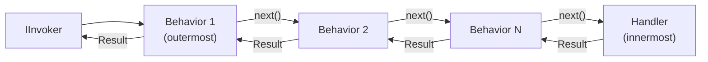

# Pipeline Behaviors

Pipeline behaviors let you wrap request, event, or stream handling with cross-cutting logic — logging, tracing, validation, or CQRS enforcement — without touching handler code. They follow the **chain-of-responsibility** (Russian-doll) pattern: each behavior calls `next(...)` to forward to the next behavior or to the handler.

All Synapse pipeline behaviors are **typed**: a behavior is bound to a specific request/response (or event, or stream-item) type through the generic interface it implements. The non-generic `HandleAsync<T>(...)` style does not exist — `HandleAsync` is a plain method and `next` is a strongly-typed delegate that takes the request and a `CancellationToken`.

## How the pipeline works



Each behavior can inspect or modify the request and the result on both sides of `next(...)`. Order is controlled explicitly by [`IOrderedPipelineBehavior`](#ordering) — not by registration order.

## Request pipeline behaviors

A request behavior implements one of two typed interfaces:

- `IRequestPipelineBehavior<TRequest, TResponse>` — for requests that return a value (`IRequest<TResponse>`).
- `IRequestPipelineBehavior<TRequest>` — for fire-and-forget requests (`IRequest`).

```csharp
public sealed class AuditCreateTaskBehavior : IRequestPipelineBehavior<CreateTaskCommand, Guid>
{
    public async ValueTask<Result<Guid>> HandleAsync(
        CreateTaskCommand request,
        RequestHandlerDelegate<CreateTaskCommand, Guid> next,
        CancellationToken cancellationToken = default)
    {
        var result = await next(request, cancellationToken);
        if (result.TryGetValue(out var id))
            Audit.Log($"Task created: {id}");
        return result;
    }
}

// Register the behavior for its request/response pair
cfg.RegisterRequestPipelineBehavior<AuditCreateTaskBehavior, CreateTaskCommand, Guid>();
```

For a fire-and-forget command, implement `IRequestPipelineBehavior<TRequest>` and register with the two-type-argument overload:

```csharp
public sealed class AuditDeleteTaskBehavior : IRequestPipelineBehavior<DeleteTaskCommand>
{
    public ValueTask<Result> HandleAsync(
        DeleteTaskCommand request,
        RequestHandlerDelegate<DeleteTaskCommand> next,
        CancellationToken cancellationToken = default)
        => next(request, cancellationToken);
}

cfg.RegisterRequestPipelineBehavior<AuditDeleteTaskBehavior, DeleteTaskCommand>();
```

## Applying a behavior to every handler

Naming each request/response pair is fine for one-off behaviors, but cross-cutting concerns (logging, tracing, auth) usually apply to *all* handlers. Make the behavior **open-generic** and mark it `[PipelineBehavior]` — the Synapse source generator discovers it, infers the kind/arity from the implemented interface, and emits one closed (Native-AOT-safe) registration per matching handler:

```csharp
[PipelineBehavior]
public sealed class TimingBehavior<TRequest, TResponse>
    : IRequestPipelineBehavior<TRequest, TResponse>
    where TRequest : IRequest<TResponse>
    where TResponse : notnull
{
    private readonly ILogger<TimingBehavior<TRequest, TResponse>> _logger;

    public TimingBehavior(ILogger<TimingBehavior<TRequest, TResponse>> logger) => _logger = logger;

    public async ValueTask<Result<TResponse>> HandleAsync(
        TRequest request,
        RequestHandlerDelegate<TRequest, TResponse> next,
        CancellationToken cancellationToken = default)
    {
        var sw = Stopwatch.StartNew();
        var result = await next(request, cancellationToken);
        _logger.LogInformation("{Request} completed in {Ms}ms", typeof(TRequest).Name, sw.ElapsedMilliseconds);
        return result;
    }
}
```

By default an assembly's `[PipelineBehavior]` classes are applied to handlers in **referenced** assemblies too. Apply `[assembly: DisableSynapseCrossAssemblyBehaviors]` to limit the cross-product to handlers declared in the same assembly.

:::note Native AOT
Registering an open-generic behavior at runtime (`AddOpenGenericRequestPipelineBehavior(typeof(...))`) is supported but is **not** Native-AOT safe for value-type responses. Prefer `[PipelineBehavior]` so the generator emits closed registrations.
:::

### Registering a behavior you don't own (e.g. from a NuGet package)

`[PipelineBehavior]` requires decorating the behavior class, so it only works for behaviors whose source you control. When a behavior ships in a referenced package — for example a company's shared pipeline library — opt into it from the composition root with `[assembly: SynapseGlobalBehavior(typeof(...))]`. The generator treats it exactly like a `[PipelineBehavior]` open generic: it closes the behavior over every matching handler and emits one closed, Native-AOT-safe registration per match.

```csharp
[assembly: SynapseGlobalBehavior(typeof(CompanyShared.LoggingBehavior<,>))]
```

Pass the **unbound** generic definition (`typeof(Foo<,>)`) — a non-generic `typeof` is the only way to hand an open generic to an attribute. The behavior type must be `public` and implement one of the pipeline interfaces; its open-generic constraints (named-type and `class`/`struct`/`unmanaged`/`notnull`/`new()`) are honoured, and pipeline position is controlled by the behavior implementing `IOrderedPipelineBehavior`. The same cross-assembly and `[assembly: DisableSynapseCrossAssemblyBehaviors]` rules apply.

## Built-in behaviors

### `SimpleLoggingBehavior<TRequest, TResponse>` / `SimpleLoggingEventBehavior<TEvent>`

Logs the request or event name and elapsed time. Register the closed pair for each handler (`SimpleLoggingBehavior<TRequest>` for void requests):

```csharp
cfg.RegisterRequestPipelineBehavior<
    SimpleLoggingBehavior<CreateTaskCommand, Guid>, CreateTaskCommand, Guid>();
cfg.RegisterEventPipelineBehavior<
    SimpleLoggingEventBehavior<TaskCreatedEvent>, TaskCreatedEvent>();
```

### `LoggingEnrichmentBehavior<TRequest, TResponse>`

Enriches the `ILogger` scope with the context's [flow identity](./context.mdx#flow-identity) and its [baggage](./context.mdx#baggage) so every log line emitted during the request automatically includes them:

```csharp
cfg.RegisterRequestPipelineBehavior<
    LoggingEnrichmentBehavior<CreateTaskCommand, Guid>,
    CreateTaskCommand,
    Guid>();
```

### CQRS boundary enforcement

`CqrsBoundaryEnforcementBehavior<TRequest>` / `CqrsBoundaryEnforcementBehavior<TRequest, TResponse>` detect when a command is dispatched from inside a query handler (or vice versa) and throw `CqrsBoundaryViolationException`. The behavior runs outermost (`Order => IOrderedPipelineBehavior.First`).

Enable it per request type:

```csharp
cfg.RegisterCqrsBoundaryEnforcement<CreateTaskCommand, Guid>();
cfg.RegisterCqrsBoundaryEnforcement<DeleteTaskCommand>();
```

Or turn it on for the whole assembly by registering the built-in behavior globally — the source generator emits the closed (AOT-safe) registrations for every handler:

```csharp
[assembly: SynapseGlobalBehavior(typeof(CqrsBoundaryEnforcementBehavior<>))]
[assembly: SynapseGlobalBehavior(typeof(CqrsBoundaryEnforcementBehavior<,>))]
```

Both attributes are needed: the one-parameter form covers requests with no response, the two-parameter form those that return one. `SynapseGlobalBehavior` is the general mechanism — see [Registering a behavior you don't own](#registering-a-behavior-you-dont-own-eg-from-a-nuget-package).

:::note
v1's `[assembly: EnableSynapseCqrsBoundaryEnforcement]` and `cfg.EnableCqrsBoundaryEnforcement()` were removed in v2 — see [Migrating to v2](./migration-v2.mdx#7-the-deprecated-cqrs-enforcement-opt-ins-are-removed).
:::

## Event pipeline behaviors

Implement `IEventPipelineBehavior<TEvent>` for a specific event type:

```csharp
public sealed class EventLoggingBehavior : IEventPipelineBehavior<TaskCreatedEvent>
{
    private readonly ILogger<EventLoggingBehavior> _logger;

    public EventLoggingBehavior(ILogger<EventLoggingBehavior> logger) => _logger = logger;

    public ValueTask<Result> HandleAsync(
        TaskCreatedEvent @event,
        EventHandlerDelegate<TaskCreatedEvent> next,
        CancellationToken cancellationToken = default)
    {
        _logger.LogInformation("Dispatching event {Event}", typeof(TaskCreatedEvent).Name);
        return next(@event, cancellationToken);
    }
}

cfg.RegisterEventPipelineBehavior<EventLoggingBehavior, TaskCreatedEvent>();
```

To cover every event, make the behavior open-generic (`EventLoggingBehavior<TEvent> : IEventPipelineBehavior<TEvent>`) and mark it `[PipelineBehavior]`.

## Stream pipeline behaviors

Implement `IStreamRequestPipelineBehavior<TRequest, TItem>`. The `next` delegate (`StreamRequestHandlerDelegate<TItem>`) is parameterless and returns the downstream `IAsyncEnumerable<Result<TItem>>`:

```csharp
public sealed class StreamLoggingBehavior : IStreamRequestPipelineBehavior<StreamTasksQuery, TaskDto>
{
    public IAsyncEnumerable<Result<TaskDto>> HandleAsync(
        StreamTasksQuery request,
        StreamRequestHandlerDelegate<TaskDto> next,
        CancellationToken cancellationToken = default)
    {
        Console.WriteLine($"Stream started: {typeof(StreamTasksQuery).Name}");
        return next();
    }
}

cfg.RegisterStreamRequestPipelineBehavior<StreamLoggingBehavior, StreamTasksQuery, TaskDto>();
```

## Ordering

Behaviors run in the order given by `IOrderedPipelineBehavior` — **not** registration order. A behavior opts in by implementing the interface and exposing an `Order` (a `uint`); **lower values run first (outermost)**, higher run last (innermost, closest to the handler). A behavior that does not implement `IOrderedPipelineBehavior` is treated as `Last`. Ties are broken by registration order (stable).

```csharp
public sealed class LoggingBehavior<TRequest, TResponse>
    : IRequestPipelineBehavior<TRequest, TResponse>, IOrderedPipelineBehavior
    where TRequest : IRequest<TResponse>
    where TResponse : notnull
{
    public uint Order => IOrderedPipelineBehavior.First;   // outermost

    public ValueTask<Result<TResponse>> HandleAsync(
        TRequest request,
        RequestHandlerDelegate<TRequest, TResponse> next,
        CancellationToken cancellationToken = default)
        => next(request, cancellationToken);
}
```

`IOrderedPipelineBehavior` exposes three convenience positions: `First` (`uint.MinValue`), `Middle` (`uint.MaxValue / 2`), and `Last` (`uint.MaxValue`). For example, register logging at `First` so it captures the full round-trip, and validation closer to the handler.

## See also

- [Validation](./validation) — `RequestValidationBehavior`, the built-in validation pipeline.
- [Observability](./observability) — `SimpleLoggingBehavior` and `LoggingEnrichmentBehavior` in detail.
- [Source Generator](./source-generator) — `[PipelineBehavior]` discovery and closed-registration emission.
- [Error Handling](./error-handling) — behaviors can short-circuit by returning `Result.Failure(...)` instead of calling `next(...)`.
