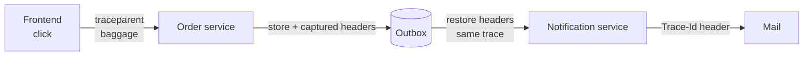

# Propagation

A user clicks **Send** in your frontend. The order service accepts the request, stores an event in the outbox, and returns. Minutes later a notification service picks that event up and sends a mail.

Propagation is what lets you answer, from the mail, *which click caused it*.

## One identity: W3C trace context

.NET already propagates W3C trace context: `DistributedContextPropagator` parses and writes `traceparent` and `tracestate`, and `SocketsHttpHandler` injects them onto every outgoing `HttpClient` request. **Synapse reuses that and adds no identifier scheme of its own.**

That means the frontend has one job — send `traceparent` — and everything downstream falls out of it:

- `traceparent`'s trace id becomes [`IContext.TraceId`](./context.mdx#flow-identity);
- its span id becomes `IContext.CausationId`;
- the `baggage` header carries business values only.

Two things trace context cannot do on its own, which is why the design is not simply "read `Activity.Current`":

| | What Synapse adds |
| --- | --- |
| **Hosts with no tracing** | With no registered `ActivityListener`, `Activity.Current` is null and there is no id at all. Synapse mints one so correlation still works, and propagates it as `traceparent` so the flow survives the next hop. |
| **The outbox** | The producing span ends when the request returns. An event dispatched minutes later — possibly after a restart — has no live span to read, so the trace context is captured with the entry and restored at dispatch. |

Note what is *not* in that table: sampling. `traceparent`'s sampled flag governs whether **spans reach your tracing backend** — the trace **id** is in the header either way, so using it as a correlation label in your own logs loses nothing.



## The pieces

| Type | Role |
| --- | --- |
| `IPropagationCarrier` | A transport-agnostic view over header-like key/value slots. |
| `IContextPropagator` | `Inject` writes state onto an outgoing carrier; `Extract` reads it from an incoming one. |
| `PropagatedContext` | What `Extract` returns: the trace context and the baggage. |
| `IInboundContextStore` | Where a boundary adapter puts extracted state until the context is built from it. |
| `PropagationKeys` | The wire keys — `traceparent`, `tracestate`, `baggage`, `traceresponse`, plus the legacy `Correlation-Context` read as a fallback. All standard names; Synapse defines none of its own. |

The default `IContextPropagator` is registered by `AddSynapse`. One implementation serves every transport; the transport-specific part is only the carrier.

### Carriers

| Carrier | For |
| --- | --- |
| `DictionaryPropagationCarrier` | Any `IDictionary<string, string>` — message headers, broker application properties, outbox entries. |
| `HttpRequestPropagationCarrier` | An incoming ASP.NET Core `HttpRequest`. |
| `HttpRequestMessagePropagationCarrier` | An outgoing `HttpRequestMessage`. |

A carrier reports a key as **absent** when it holds more than one value. Choosing between conflicting values would be arbitrary, and propagated state is only meaningful when unambiguous.

## Inbound: HTTP

`UseSynapsePropagation()` recovers the trace context and baggage from the incoming request:

```csharp
var app = builder.Build();

app.UseSynapsePropagation();   // add it early — before any endpoint runs
```

Identity comes from `traceparent` alone. Synapse reads no identity header of its own, so a request without `traceparent` simply starts a new flow with a minted trace id.

Two response headers go back, both write-only — nothing reads them in again:

- **`traceresponse`** — the W3C Trace Context Level 2 response header, `00-<trace-id>-<span-id>-<flags>`, so conformant tooling can continue the trace from a response.
- **`Trace-Id`** — the bare 32-hex trace id, for the human who needs one string to paste into a tracing backend. No `X-` prefix: RFC 6648 deprecated that in 2012.

Inbound baggage is read from `baggage`, falling back to the pre-W3C `Correlation-Context` name so business values from an older ASP.NET Core service survive. Only the W3C name is ever written.

### Browser setup

The frontend needs an OpenTelemetry JS propagator (or a hand-written header) plus CORS on both sides:

```csharp
policy.WithHeaders("traceparent", "tracestate", "baggage")  // Access-Control-Allow-Headers
      .WithExposedHeaders("traceresponse", "Trace-Id"); // Access-Control-Expose-Headers
```

See [ASP.NET Core Integration](./aspnetcore#propagation-middleware) for the options, including the untrusted-edge mode.

## Inbound: messages and other transports

Any transport works the same way — extract into the store before anything resolves `IContext`:

```csharp
public async Task OnMessageAsync(BrokerMessage message, CancellationToken ct)
{
    using var scope = _serviceProvider.CreateScope();

    var carrier    = new DictionaryPropagationCarrier(message.Headers);
    var propagator = scope.ServiceProvider.GetRequiredService<IContextPropagator>();
    var store      = scope.ServiceProvider.GetRequiredService<IInboundContextStore>();

    store.Inbound = propagator.Extract(carrier);

    // Everything resolved from this scope now shares the sender's flow
    var invoker = scope.ServiceProvider.GetRequiredService<IInvoker>();
    await invoker.InvokeAsync(message.ToCommand(), ct);
}
```

## Outbound: HTTP

Add `SynapsePropagationHandler` to any client whose calls should stay part of the flow:

```csharp
services.AddHttpClient("billing")
        .AddHttpMessageHandler<SynapsePropagationHandler>();
```

The handler only acts when a context already exists — an outbound call made outside any unit of work does not get a flow invented for it. It writes the **baggage**; `traceparent` and `tracestate` normally come from `SocketsHttpHandler` and the platform propagator, which is why baggage is usually all that is left to do.

The exception is a host with **no tracing wired**. There is no `Activity`, so nothing writes `traceparent` and the receiver would start a brand new trace — the flow would break at every hop even though `IContext.TraceId` knew the answer. Synapse fills that gap: with no usable activity it writes `traceparent` itself from the context's trace id, with the sampled flag off and a parent id derived from the trace id (there is no real span to name). A receiver continues the trace and treats the parent span as unavailable, exactly as it would for any non-recording caller.

It finds the context through the execution context rather than through DI. `IHttpClientFactory` builds message handlers in a scope of its own and caches them across requests, so an injected `IContextAccessor` would never be the one belonging to the unit of work making the call. Two things follow: the handler needs no scope of its own and can be registered anywhere, and the context has to have been read on the same execution flow as the outbound call — which is the case for anything a handler does, but not for work fired off with `Task.Run` before the context was ever touched.

## Outbound: the outbox

This is the boundary that matters most, and the one that used to break the chain.

`OutboxEntry.Headers` holds the propagation headers **captured when the event was stored**. It has to be captured then rather than read at dispatch time, because by dispatch time the producing request is gone.

On dispatch, Synapse:

1. rebuilds the flow state from the stored headers;
2. starts a `synapse.outbox.dispatch` activity **parented on the stored trace context**, so the dispatch joins the originating trace and the whole flow — click to mail — shows up as one trace under one id.

That is the whole mechanism, and the parenting does double duty. Because the dispatch activity is *in* the originating trace, `Activity.Current.TraceId` is already the originating trace id for the duration of the dispatch — so any context created underneath it picks the right identity up through the normal [sourcing rules](./context.mdx#where-traceid-comes-from). No ambient variable has to be set and unset around the call, and nothing can leak an entry's identity into the caller.

The parent span has already ended by then. That is expected and legal: an entry dispatched hours later, or retried, simply adds spans to a long-lived trace, which is what makes the whole flow reviewable in one place.

This works on a host with no tracing too, because capture writes `traceparent` from the context when there is no activity to take it from (see [above](#outbound-http)). An entry stored with a context always carries a trace id; only an event stored *outside any unit of work* has none, and its dispatch is genuinely a root.

If you implement `IEventOutboxStorage`, keep the headers as given. Synapse tolerates keys that differ only by case on the way back in — a case-sensitive column can produce both `traceparent` and `TraceParent` — and one unreadable entry never aborts the rest of the batch.

:::note Batch consumers must use links instead
Parenting expresses a *single* cause. A consumer that handles several messages with several different
parents in one span has to attach an `ActivityLink` per message — the OpenTelemetry messaging conventions
require it there.
:::

If you implement `IEventOutboxStorage` yourself, **store `headers` alongside the payload**. Without them a dispatched entry cannot be tied back to the action that produced it.

## What counts as a boundary

Propagation only kicks in where a **new context** is built. That distinction decides whether `CausationId` is set:

| Hop | New context? | `CausationId` |
| --- | --- | --- |
| `EmitMode.Now` — event dispatched in the same scope | no | unchanged; it is the same unit of work |
| Outbox dispatch | yes | the producing span's id |
| Inbound HTTP from another service | yes | the caller's span id |
| Broker message consumed in a fresh scope | yes | the sender's span id |

`TraceId`, by contrast, is the same across every row — that is the point of having both. Because causation comes from span ids, it is `null` wherever nothing upstream was recording.

## Why extraction happens at creation

`IContextFactory.Create` takes the inbound state as a parameter, and a context's identity can never be changed afterwards. That is a deliberate constraint, not an inconvenience.

The alternative — create a context, then patch the trace id onto it when the boundary adapter runs — fails in a way that is very hard to notice. `IContext` is a scoped DI registration, so whichever component resolves it *first* pins the instance. Patching afterwards leaves earlier readers holding the old identity while later ones see the new one: handlers log one trace id while the response header reports another.

With extraction at creation there is exactly one context object per scope, and the boundary adapter's ordering relative to other components stops mattering — it only has to run before the first component actually *reads* the context.

## Limits and safety

- Baggage is capped at **64 entries and 8192 bytes** (`BaggageLimits`), enforced on both `SetBaggage` and extraction. Excess is dropped and logged, never thrown: a peer sending bad baggage must not be able to fail your request.
- The 8192 bytes are counted on the **wire form**, percent-encoded. A value made of characters that need escaping — commas, spaces, accents — costs up to three bytes per byte, so it uses up the budget faster than its length suggests.
- Keys must be header tokens: no commas, equals signs, whitespace or control characters. **Values are less restricted** — they are percent-encoded, so `Acme, Inc` or `a=b` is fine; only control characters are refused.
- Malformed inbound baggage degrades entry by entry — the usable entries survive.
- What leaves the process as baggage is exactly `IContext.Baggage`. Entries living only on `Activity.Baggage` are not forwarded, so the platform's own baggage header never rides along and an untrusted boundary's decision to drop inbound baggage actually holds.
- Baggage is visible to **every** downstream service, including third parties. Never put confidential values in it.
- The trace id is a label for correlating logs and spans. A caller-supplied `traceparent` is exactly as forgeable as any other client input, so it is never an authorization input.

## See also

- [Context](./context.mdx) — the three surfaces and what belongs in each.
- [ASP.NET Core Integration](./aspnetcore#propagation-middleware) — middleware options and the untrusted edge.
- [Outbox](./outbox.mdx) — storage, retries and dead-lettering.
- [Observability](./observability.mdx) — activities, metrics and log scopes.
